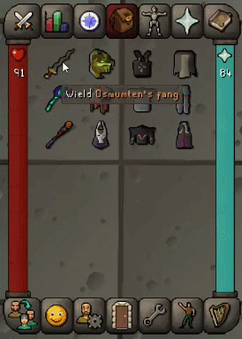
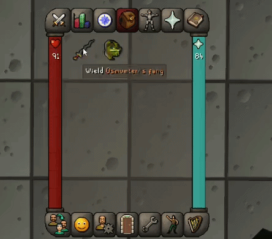

# Gear Flash

Gear Flash makes gear switching easier by showing you exactly what to equip next.

Set your weapons or other items as **triggers**, assign your gear to **style groups**, and Gear Flash takes care of the rest. When you equip a trigger, the matching gear flashes in your inventory.

## See It in Action

## Easy to Set Up

Everything is configured directly from your inventory.

Simply **Shift + Right Click** an item to set it as a trigger or add it to a style group. Items can be part of multiple groups, and anything you've added can be removed the same way.

## Make It Your Own

The plugin settings let you customize how Gear Flash looks and feels, including the highlight colors and other visual options.

Set it up your way and let Gear Flash make your next switch easy to spot.
